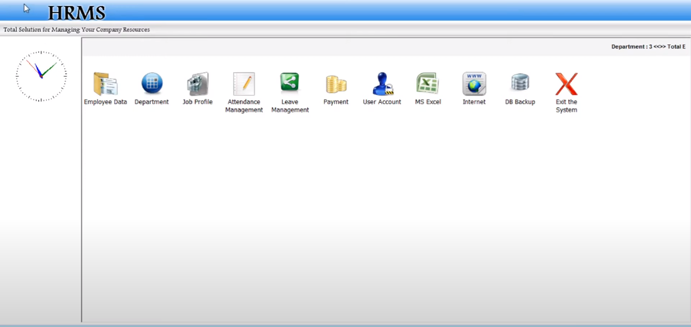
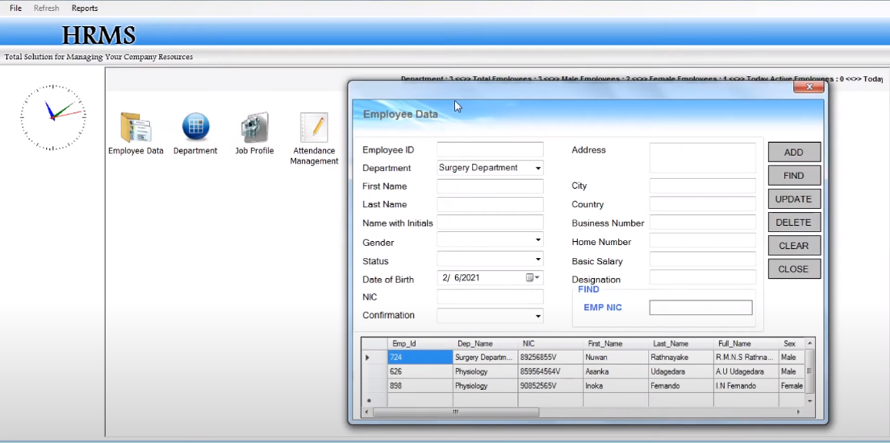
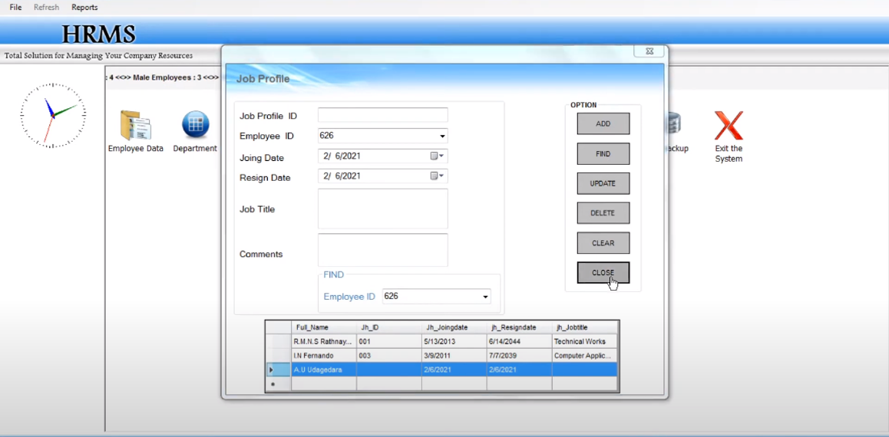

# HRMS - Human Resource Management System

This ASP.NET-based web application streamlines the recruitment process for ABC company's HR team. Key features include creating job vacancies, storing applicant data, initiating and scheduling interviews, storing interview results, and hiring applicants. The system also generates reports for HR use.

## Features
- Create job vacancies
- Store applicant data
- Initiate and schedule interviews
- Store interview results
- Hire applicants
- Generate reports for HR use

## Installation
1. Clone the repository:
   ```bash
   git clone https://github.com/SyedaFatimaZehra/HRMS.git
   ```
2. Open the solution file `HRMS.sln` in Visual Studio.
3. Restore the NuGet packages.
4. Build the solution.
5. Run the application.

## Usage
1. Launch the application.
2. Navigate to the HRMS dashboard.
3. Use the menu to access different features such as creating job vacancies, managing applicants, and generating reports.

## Screenshots
### HR Dashboard


### Job Vacancies


### Applicant Management


## Contributing
Contributions are welcome. Please submit a pull request or open an issue to discuss your ideas.

## License
This project is licensed under the MIT License. See the [LICENSE](LICENSE) file for details.
